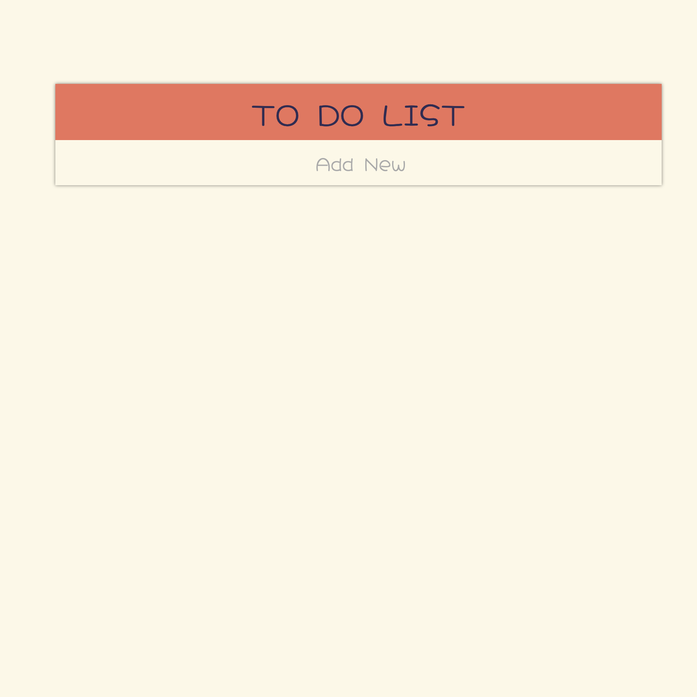
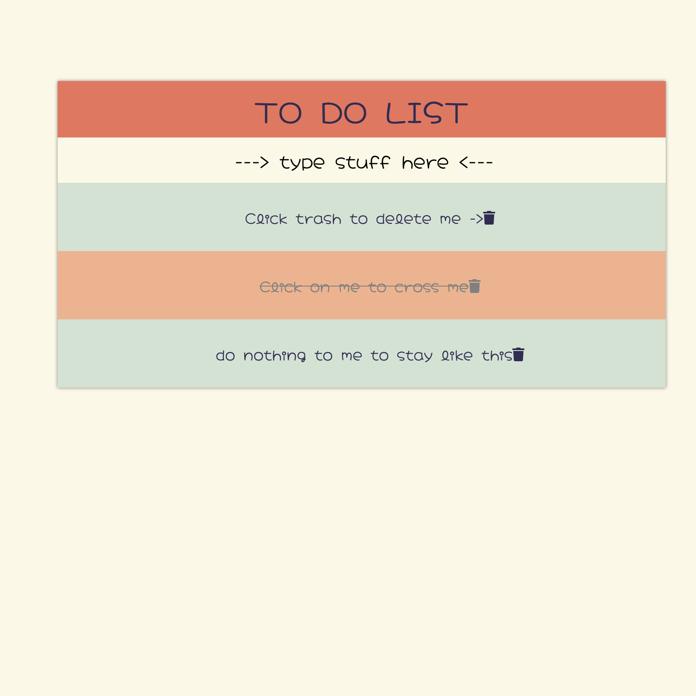

<h1>
Todo List using jQuery
</h1>

This is a simple web app build using HTML5, CSS3, and the jQuery library in JavaScript.

It has three simple functionalities; adds a task, removes a task and crosses it out. Below are some screenshots on how it looks...

Default state without any tasks added:

Active state with tasks added and crossed out:

And now for a completely useless, random fact...because why not!

<h3>If you open your eyes in a pitch-black room, the color you'll see is called "eigengrau."
